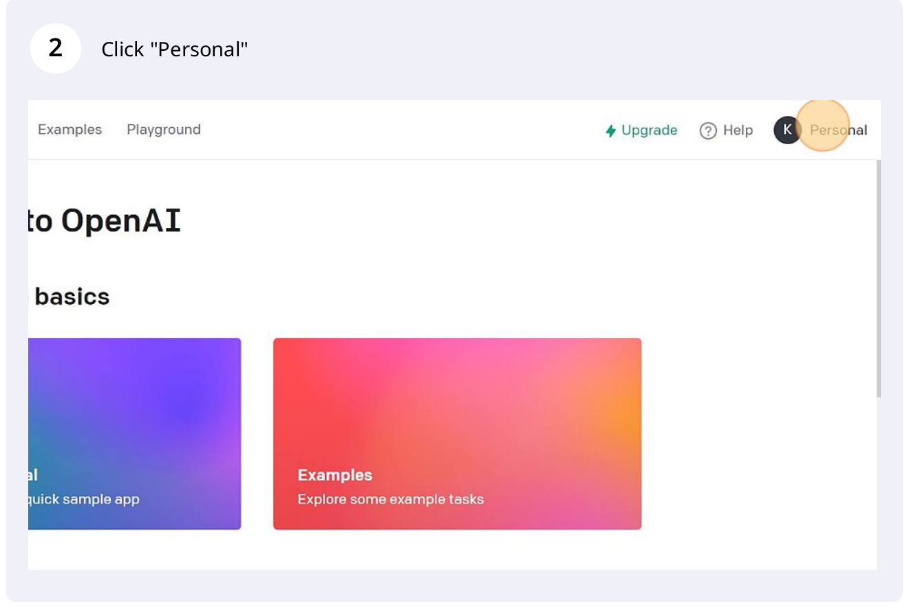
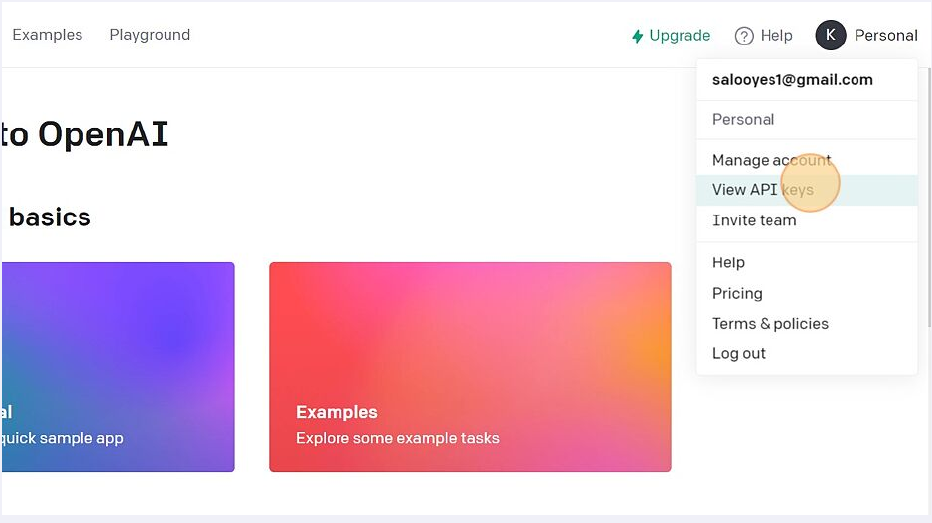
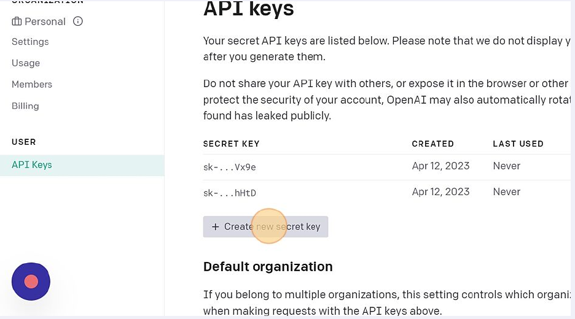
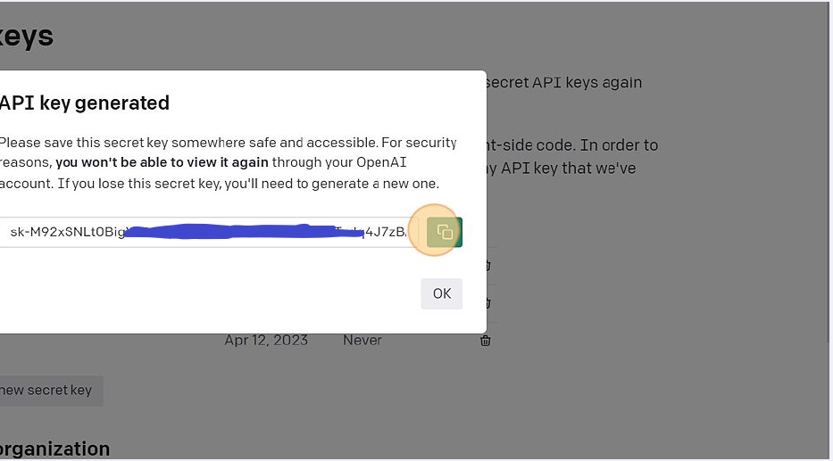
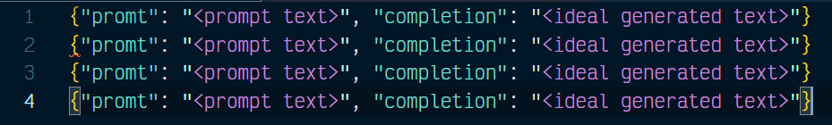
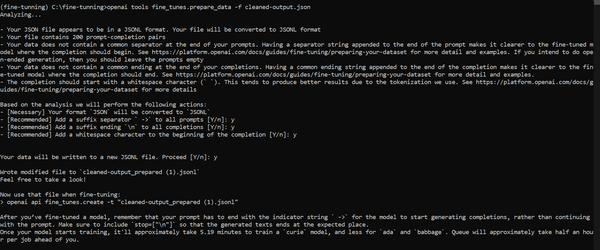
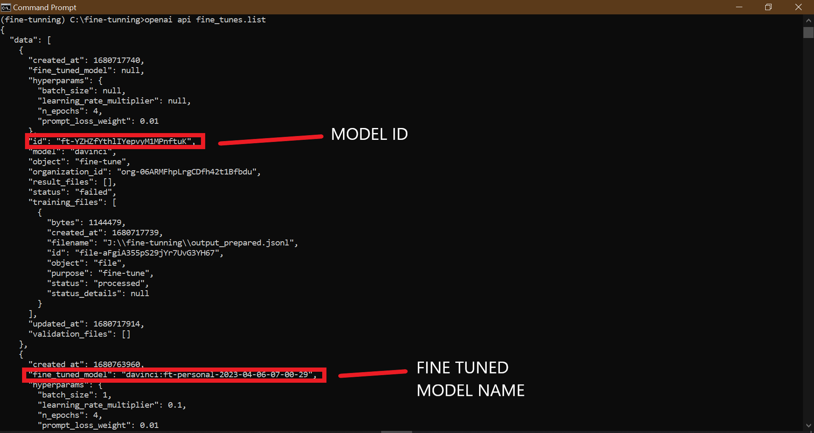
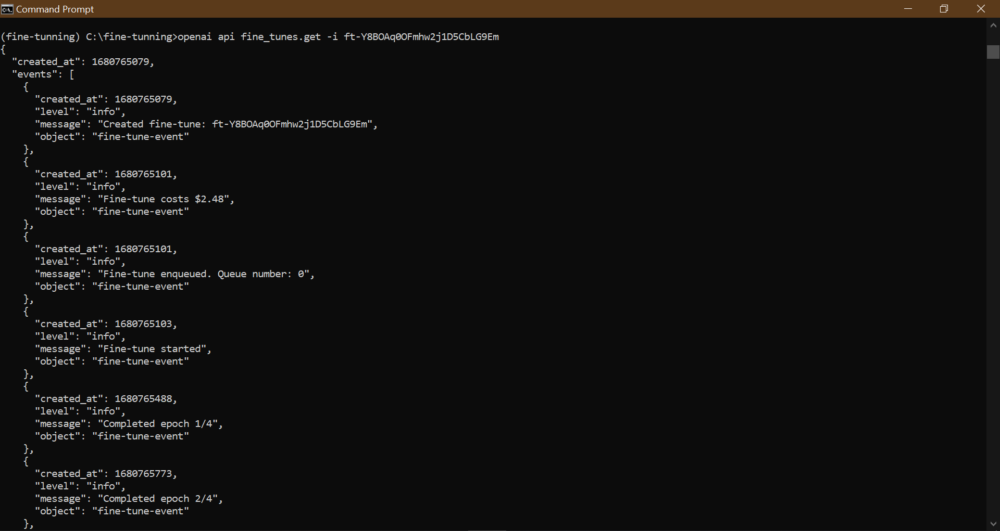
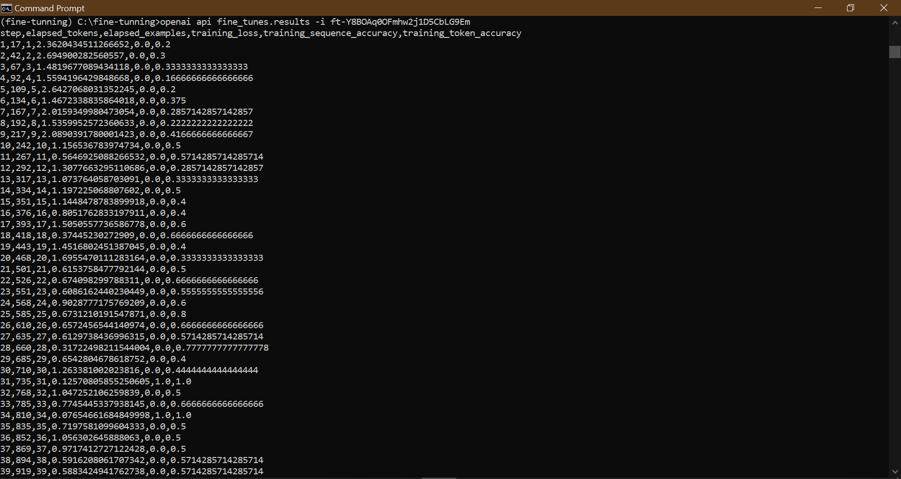

# FINE TUNE CHATGPT MODEL

## Why fine tune ChatGPT model

1. ### Enhanced specificity:
   
                                       A tailored model better understands technical language, improving documentation accuracy.

2. ### Improved efficiency:
   
                                A fine-tuned model generates relevant information quickly, reducing time spent on documentation.

3. ### Consistency and quality:
   
                                   The model maintains a consistent style, producing high-quality content with fewer errors.

4. ### Knowledge transfer:
   
                                   The model's deeper understanding of fine-tuning nuances aids users in grasping complex concepts.

5. ### User experience:
   
                               Accurate, comprehensible documentation allows users to learn and apply fine-tuning effectively.

6. ### Scalability:
   
                   The model generates documentation for various scenarios, easing scalability across projects or teams.

7. ### Cost savings:
   
                    Automating documentation reduces labor costs while improving overall efficiency.

8. ### Continuous improvement:
   
                                               The model can be updated with new information, ensuring current and useful documentat

## Step1: Selecting a Model:

Before fine tuning a model these points should be kept in mind,

1. What is your budget?

2. How complex or simple your task is for which you are training the model?

3. What mode of ChatGPT do you wants to train?

The models that can be fine tuned are `Davinci` , `Curie`, `Babbage` and `Ada`.

Each of these models have their own pricing for fine tuning.

*for more info visit* [openai.com/pricing](Model Pricing)

Keep in mind these pricing are per 1000 tokens.

> tokens as pieces of words used for natural language processing. For English 
> text, 1 token is approximately 4 characters or 0.75 words. As a point of
>  reference, the collected works of Shakespeare are about 900,000 words 
> or 1.2M tokens.
> 
> To learn more about how tokens work and estimate your usage…
> 
> - Experiment with our interactive [Tokenizer tool](https://beta.openai.com/tokenizer).
> - Log
>    in to your account and enter text into the Playground. The counter in 
>   the footer will display how many tokens are in your text.

The script named as `token-cost.py` [Token Cost](./token-cost.py)  token cost is a rough estimation of the total tokens.

> Disclaimer: The final value could be a little bit different from the script due to white spaces etc

## Step 2: Installation

Now that model have been decided to fine tune. And getting ready to fine tune the said model, the recomended tool is OpenAI command-line interface (CLI). To use the said tool first install it.

It is recomended to activate the virtual enviroment but not necessary.

Follow these steps to install openai cli

1. run cmd/terminal
   
   2. Now activate the virtual enviroment

```bash
for Windows 
path\Scripts\activate

For Linux/MAC
source path/bin/activate
```

3. Run the installation command
   
   ```bash
   pip install --upgrade openai
   ```
   
   4. Instllation completed

## Step 2: Creating API key and then exporting it

To any work with the model whether it is fine tuning, validation or testing it or using it as a day to day tool, you would need the API key.

1. Navigate to [platform.openai.com](https://platform.openai.com/)

2. Click "Personal"
   
   
   
   3. Click "View API keys"
      
      
   
   4. Click "Create new secret key‍"
      
      
   
   5. Click this copy button.
      
      
      
      > DIsclaimer: Keep this key at somewhere safe because you would be able to see or copy the key again. You have to create a new key
      > 
      > if you did store it properly.
      
      Now, all done. Click Okay. 
   
   ### Saving API KEY CMD/Terminal
   
   Now, that you have the API key open CMD/TERMINAL and use the following command

```bash
export OPENAI_API_KEY="<OPENAI_API_KEY>"
```

Just replace <OPENAI_API_KEY> with the key you got from Openai website. 

## Step 2: Dataset

This is one of the most important step as this step would decide how the fine tuned model would behave and perform.

In this step we gather the data upon which the model is to be fine tuned.

### Step No 1:

Gather the data, and the data should be in this format.



For more information how to best way you can prepare your training data visit

                                [OpenAI Best Practices for data preparation](https://platform.openai.com/docs/guides/fine-tuning/preparing-your-dataset)

### Converting CSV files to JSON and Cleaning them Afterwards

Since the file used in the tutorial are json. You can convert the csv files to json with the `csv to json script` [CSV to JSON](./csv-to-json.py)

> Disclaimer: Open the Script and replace with the input and Output file names and other required manipulations.

To clean/remove something from CSV to JSON files you get extra unnecessary characters that needs to be removed. Use the `cleaning json` [Cleaning JSON](./cleaning-json.py)

### Step 2:

In this step the dataset is prepared for trainning via a data preparation tool.

> Disclaimer: The tool would give errors if the dataset is not in proper format or proper extension. Only **CSV, TSV, XLSX, JSON** or **JSONL** extensions are acceptable.

Run the following the command in CMD/Terminal

```bash
openai tools fine_tunes.prepare_data -f <LOCAL_FILE>
```

Replace the with file name or file path.

Follow the instructions on screen, if it require recomended changes it would prompt those, otherwise it would start its operation



Keep in mind that you would need 2 files

one for training and the other for validation and they both should be mutually exclusive.

At this stage it would information of the training time and queue times too.

## Step 3 Creating Fine Tune Model

In this step, the files that were prepared by using the tool are used for traing and validation.

```bash
openai api fine_tunes.create -t <TRAIN_FILE_ID_OR_PATH> -v <VALIDATION_FILE_ID_OR_PATH> -m <MODEL>
```

Replace with training file name or path replace with the validation file name or path and finally replace with the model being used for fine tuning.

At this stage it would create ID which would be used later alot. It would also inform the user about the cost of training and validation.

This step takes alot of time.

if for some reason the training is disrubted, it can restarted with the following command

```bash
openai api fine_tunes.follow -i <YOUR_FINE_TUNE_JOB_ID>
```

Replace witht the ID from the early step.

When the job is done, it should display the name of the fine-tuned model.

In addition to creating a fine-tune job, you can also list existing jobs, retrieve the status of a job, or cancel a job.

To check the list of fine tunes model use the following command in CMD/Terminal

```bash
openai api fine_tunes.list
```

This would return with all of the fine tune models if this is not the first model.



But, to get information on a specific model use the following command in CMD/Terminal

```bash
openai api fine_tunes.get -i <YOUR_FINE_TUNE_JOB_ID>
```

Replace with the specific model ID to get detailed information about that model.



Now finally to cancel a model use the following command in CMD/Terminal

```bash
openai api fine_tunes.cancel -i <YOUR_FINE_TUNE_JOB_ID>
```

Replace with the ID of the model to be cancelled.

## Step 4 Using a Fine tune Model:

When the job is finished it would be updated on the CMD/Terminal.

Or one can check the the `fine_tuned_model` field which will be populated with the name of the model in case of successful training.

To check `fine_tuned_model` use

```bash
openai api fine_tunes.get -i <YOUR_FINE_TUNE_JOB_ID>
```

After completion it still may take a few minutes for the model to take prompts.

The fine tuned model can be either used in `playground` visit [Playground](https://platform.openai.com/playground)

You can start making requests by passing the model name as the `model` parameter of a completion request

Open CMD/Terminal

```bash
openai api completions.create -m <FINE_TUNED_MODEL> -p <YOUR_PROMPT>
```

Replace the with the model ID of the trained model. The prompt goes into .

But at the same time the prompt can sent using the API through a python script `Prompt-Script` [Prompt Script](./Prompt-Script.py)

> Disclaimer: You need to manioulate the above scripts according to your need and demand.

The pricing of every completion depends on the token used.

For more information on pricing visit [Pricing](https://openai.com/pricing)

### Deleting a Model

To delete a fine-tuned model, use the command

```bash
openai api models.delete -i <FINE_TUNED_MODEL>
```

Replace the with the model ID of the model you wants to delete.

## Step 5 Getting Results

Now, that the model is trained, validated and tested a little bit. It time to get the results of it performance. 

There are 2 methods to get the results on the model.

### CMD/Terminal

You can get the result on a specific model by this command

```bash
openai api fine_tunes.results -i <YOUR_FINE_TUNE_JOB_ID>
```

<YOUR_FINE_TUNE_JOB_ID> would be replace the mode ID



Every column name is written on the top. 

However I recomend to use the python script to get the results and save them in a csv file. 

### METHOD 2

You can get the result in csv file. Run the script `open-finetune-result.py` [Fine Tune Results](./openai-finetune-result.py)

> Disclaimer: Change the API key with your own API Key. 
